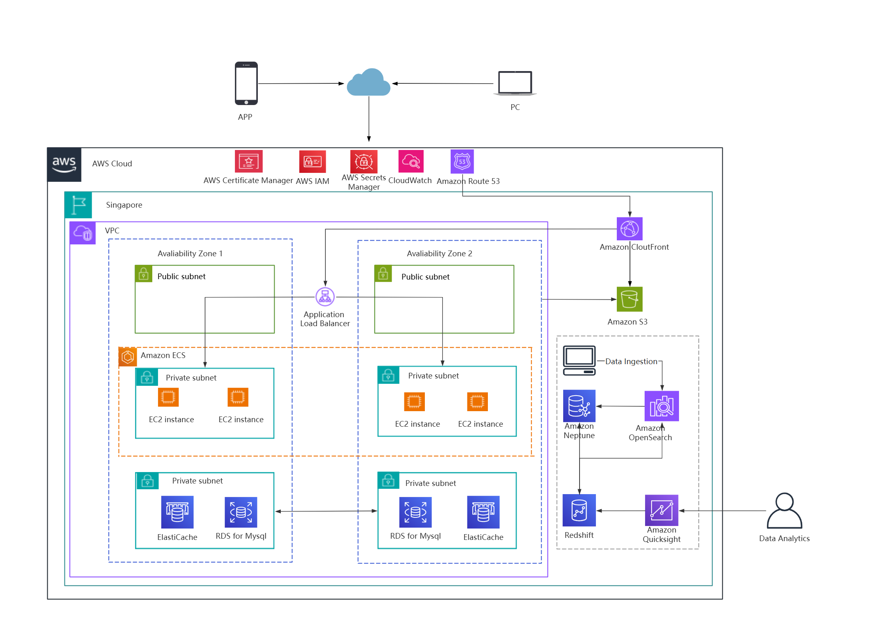
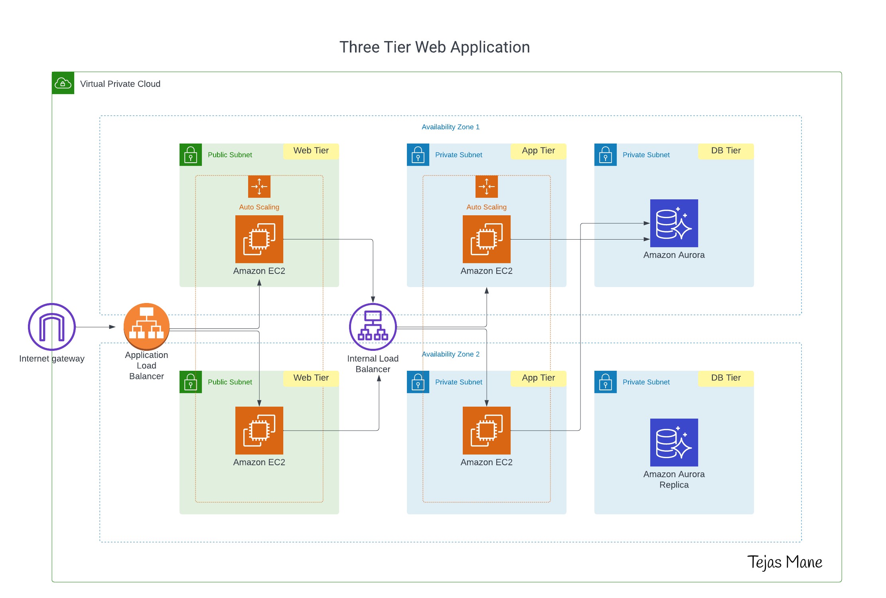
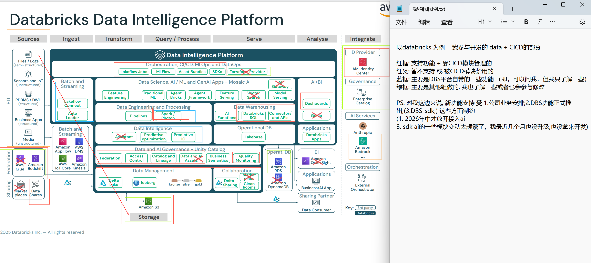

# topics

- cloud
  - cloud infra
- devops
  - from code to app deployment
- big data
- ai

## AWS

examples provided for context:

## databricks

[databricks lakehouse architecture reference](https://docs.databricks.com/aws/en/lakehouse-architecture/reference.html)

databricks feature demo, product tour: <https://www.databricks.com/resources/demos/library?type=2030>

about msj, arch data part:

